# DriveLink Complete Scenario and Workflow Handbook

**Version:** 1.1  
**Verified against:** The DriveLink codebase on 13 August 2026  
**Audience:** Founder, operations team, support team, product designers, testers, lawyers, insurers, and future partners  
**Companion record:** `DRIVELINK_SCENARIO_AUDIT_FIX_REGISTER_2026-08-13.md`

> This is an internal operating handbook, not public advertising and not legal, insurance, tax, or financial advice. No finite document can predict every future browser bug or human action. This handbook covers every current DriveLink role, supported product state, main market situation, expected failure, and foreseeable abuse path found in the live product structure.

---

## 1. DriveLink in one simple picture

DriveLink is a marketplace and record-keeper. It does not own the listed vehicles, provide every driver, guarantee every roadside service, or hold the rental payment and deposit.

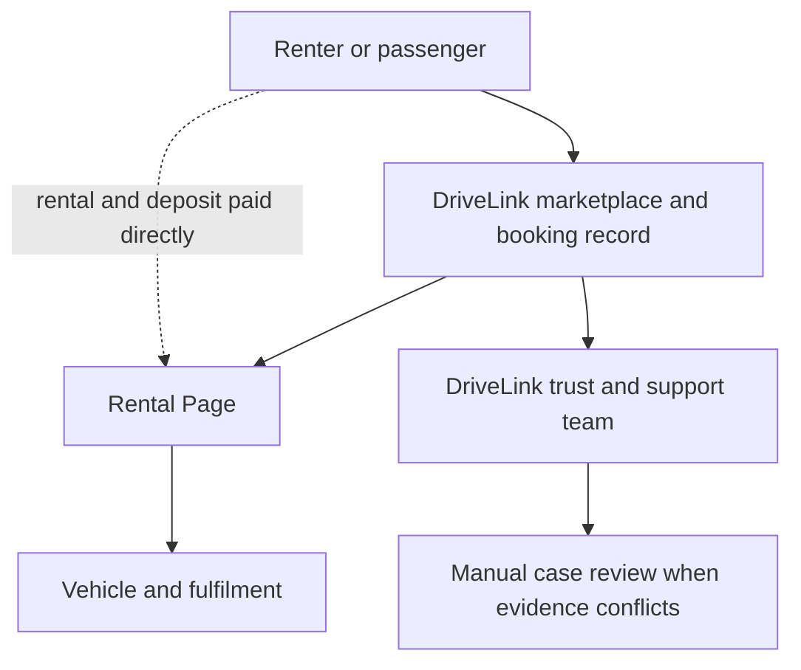

### Current money truth

| Item | Current rule |
|---|---|
| Listing a vehicle | Free permanently |
| DriveLink booking confirmation fee | Rs. 0 |
| Provider commission | Rs. 0 |
| Rental amount | Paid directly by the renter to the Rental Page |
| Refundable deposit | Paid and returned directly between the parties |
| DriveLink's job | Record the stated method, amount, and two-sided confirmations |
| Listing boosts | Not active |

DriveLink records what both sides say happened. A record is not the same as DriveLink holding or guaranteeing the money.

---

## 2. The five layers that protect a workflow

Important actions are not protected by one button alone.

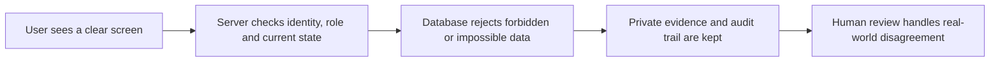

| Layer | Example |
|---|---|
| Clear screen | The renter sees that the deposit is separate from the rental amount. |
| Server check | A direct booking request is refused if identity is not verified. |
| Database rule | A rental cannot start without both signatures and pickup evidence. |
| Private evidence | Identity documents are served through a controlled viewer, not a public file link. |
| Human review | A disputed damage charge does not automatically punish either person. |

The strongest workflows use all five. Less serious actions may use only the first three.

---

## 3. Audience and market map

### 3.1 Renters and visitors

| Code | Person | Digital confidence | What they usually need | Current fit |
|---|---|---:|---|---|
| R1 | First-time local renter, often 18-22 | Medium with apps, low rental knowledge | Plain costs, age rules, licence rules, safe pickup | Supported when they meet the listing's enforced age and licence rules |
| R2 | Repeat local renter | Medium to high | Fast search, availability, quick response, reliable records | Supported |
| R3 | Long-term renter | Medium | Monthly pricing, maintenance expectations, renewals, periodic checks | Partly supported; monthly rates exist, full long-term operations do not |
| R4 | Foreign visitor | High app use, low Sri Lankan rule knowledge | Permit guidance, airport clarity, insurance truth, emergency steps | Supported for a controlled self-drive or with-driver booking; legal permit remains the traveller's responsibility |
| R5 | Sri Lankan abroad booking for family | High | Separate booker, payer and driver | With-driver can be requested; self-drive for another person is not supported |
| R6 | Family or group using a supplied driver | Mixed | Passenger/luggage/route/waiting/overnight clarity | Basic with-driver booking supported; full itinerary workflow not built |
| R7 | Low digital-confidence or WhatsApp-first user | Low to medium | Few choices, plain wording, visible next step, human help | Mobile structure is improved; English-only remains a major limit |
| R8 | Weak-data or unstable-network user | Mixed | Small pages, retryable uploads, no lost work | Listing drafts are saved locally; large evidence uploads can still need a retry |
| R9 | Keyboard, screen-reader, low-vision or motor-impaired user | Mixed | Focus control, labelled buttons, readable contrast, stable dialogs | Core dialogs and controls improved; full independent accessibility audit remains required |

### 3.2 Providers

| Code | Person | Digital confidence | What they need | Current fit |
|---|---|---:|---|---|
| P1 | Registered owner with one or a few vehicles | Low to medium | Guided listing, renter checks, handover evidence | Supported |
| P2 | Family, leased-fleet or managed-vehicle operator | Low to medium | A truthful way to state authority without pretending to be the registered owner | Supported only when the page has real authority; declaration is recorded and DriveLink may request written proof |
| P3 | Informal micro-rental operator | Low to medium | Simple phone-first workflow, clear cost rules and no accounting jargon | Supported as a Personal Rental Page; it does not receive a registered-business label |
| P4 | Small rental business | Mixed | Multiple vehicles, staff, bookings, inspections and records | Supported within one or more Rental Pages |
| P5 | Multi-brand or multi-location owner | Medium | Separate public pages and a page switcher | Multiple pages supported; true branches are not |
| P6 | Registered rental business | Medium to high | Business certificate and public business status | Supported after manual review |
| P7 | Large enterprise fleet | High management, mixed operations | API/feed/category inventory/ERP handoff | Not built; controlled discovery or manual pilot only |

### 3.3 Rental Page staff

| Role | Can do | Cannot do by default |
|---|---|---|
| Manager | Run bookings, handovers, money records, cases, fleet, support and settings; confirm the page's right to list a vehicle | Transfer page ownership without the owner flow |
| Booking agent | Review requests and message renters | Sign the owner agreement, record money, edit fleet, or decide cases |
| Handover agent | Record pickup/return inspections and message renters | Change fleet terms or own the page |
| Fleet editor | Prepare vehicle details, photos, documents and availability | Make the legal right-to-list declaration, publish a rejected listing, or read renter bookings/documents |
| Support agent | Reply in booking/support messages | Change booking state, money, inspections, or fleet |

Document access is narrower than a role. A manager, booking agent, or handover agent also needs a separate owner-granted document permission. Fleet and support roles cannot be granted that permission.

### 3.4 DriveLink and external participants

| Code | Participant | Current role |
|---|---|---|
| A1 | DriveLink admin/trust reviewer | Reviews listings, businesses, licences, reports, overdue cases and disputes |
| A2 | DriveLink support operator | Helps users recover from failures without rewriting evidence informally |
| A3 | Police, insurer, lawyer or mediator | Receives exported evidence from a party; has no ordinary platform account workflow |
| A4 | Chauffeur supplied by a Rental Page | Not a separate DriveLink role; the Rental Page remains responsible for assignment |
| A5 | Mechanic or recovery operator | Not a separate DriveLink role; arrangements stay with the page or external provider |
| X1 | Broker or lead scraper | Threat actor the public-contact and watermark barriers are designed to discourage |
| X2 | Fake renter, fake owner, spammer or abusive staff member | Threat actor handled through verification, limits, permissions, audit and manual review |

---

## 4. Language, learning and digital-fluency rules

### Current reality

- The product interface is in English.
- Guide videos are shown inside DriveLink and remember the local playback position.
- Public renter and traveller guides are available to everyone.
- Owner, staff and admin guides appear only when the signed-in account has that responsibility.
- Sinhala and Tamil subtitle files exist in the video package, but the YouTube player can show them only if those caption tracks are uploaded and enabled on YouTube.
- A public YouTube Shorts address can be forwarded outside DriveLink. Role filtering is product guidance, not a security boundary.

### Copy rule by confidence level

| User need | DriveLink wording rule |
|---|---|
| New renter | Say `money you pay directly to the Rental Page`, not `settlement ledger`. |
| Owner | Say `record that you received the deposit`, not `post a financial acknowledgement`. |
| Tourist | Explain that a permit declaration is not legal approval. |
| Staff | Show only actions belonging to the assigned role. |
| Admin | Show evidence, deadline and consequence together. |
| Legal evidence reader | Preserve exact timestamps, identities, accepted terms and audit events. |

### Safety-critical translation priority

Before a broad Sinhala/Tamil campaign, human-reviewed translations are needed for:

1. Identity and licence consent.
2. Self-drive permit warning.
3. Rental, deposit and fee explanation.
4. Agreement summary and acceptance.
5. Pickup and return confirmation.
6. Accident, late-return and dispute steps.
7. Account deletion and document retention.

Machine translation can prepare a draft. It must not be the final authority for legal or safety language.

---

## 5. Complete renter lifecycle at a glance

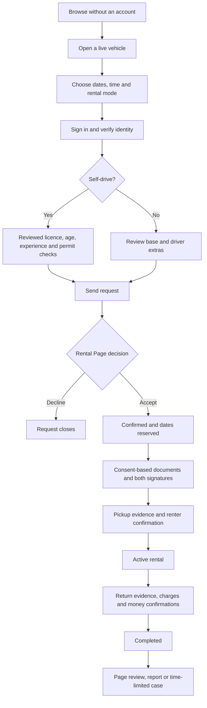

### Booking states in plain English

| State | Meaning | Who can move it next |
|---|---|---|
| Requested | Older/internal request state | System or renter cancellation |
| Waiting for confirmation | Rental Page must accept or decline | Rental Page, or renter can cancel |
| Confirmed: reserved | Dates are committed; agreement and pickup preparation begin | Rental Page starts at handover; either side may cancel under allowed rules |
| Rental active | Vehicle has been handed over through the required checklist | Rental Page closes after return, or either side opens a case |
| Completed | Return and settlement checklist finished | A time-limited case can still open |
| Under dispute | DriveLink must review evidence | Admin resolves with a recorded reason |
| Declined | Page said no or request expired | Final |
| Cancelled | A party ended it under the cancellation path | Final |
| Legacy payment review | Old compatibility value only | Not used by new Rs. 0 confirmation-fee bookings |

---

## 6. Workflow 1: Browse, search and compare

**Who:** Signed-out visitor, first-time renter, repeat renter, tourist, low-confidence user.  
**Starting point:** Home, search, an SEO page, a Rental Page, or a shared vehicle link.

### Normal path

1. Visitor chooses city, dates, vehicle type, self-drive/with-driver, insurance or price filters.
2. Search returns only `available` vehicles belonging to a verified, active, unblocked, undeleted Rental Page whose current owner is still identity-verified and eligible and whose page phone was verified by OTP.
3. The vehicle itself must have a private plate record, at least four photos, a recorded right-to-list declaration, a real rental mode and price, no unresolved rejection, and an admin publication decision.
4. The visitor opens a vehicle and sees actual listing photos, provider type, pricing, deposit, mileage, fuel, insurance declaration, rules and service labels.
5. Availability shows committed bookings and owner-created blocks without revealing another renter's identity.
6. Opening a listing records a privacy-conscious view unless the browser or user opted out.

### Failure and abuse scenarios

| ID | Situation | Barrier | What the visitor sees or does |
|---|---|---|---|
| BR-01 | No matching vehicle exists | Honest empty result | Change dates, city, type or mode; no fake stock is shown |
| BR-02 | A copied listing was removed or page was paused | Public query checks current page and listing state | `Not found` or unavailable, not a stale booking form |
| BR-03 | Vehicle row says available but page is blocked | Page-state check in public query and booking server | Vehicle stays hidden and cannot be booked directly |
| BR-04 | Pending request exists from somebody else | Pending requests do not block browsing | Visitor may also request; the first accepted request wins the dates |
| BR-05 | Confirmed booking overlaps | Privacy-safe availability and server overlap check | Dates are unavailable without exposing who booked |
| BR-06 | Owner maintenance block overlaps | Availability check | Dates are unavailable |
| BR-07 | Provider places phone/link in public text | Form, server and database contact detector | Text is rejected; contact unlock stays tied to confirmation |
| BR-08 | Broker copies vehicle photos | Server watermark on newly uploaded photos | Reused image visibly points back to DriveLink; it is deterrence, not perfect DRM |
| BR-09 | Old photo was uploaded before watermarking | Backfill process | Existing eligible photos are rewritten through the watermark backfill |
| BR-10 | Visitor blocks analytics | GPC, Do Not Track or local preference | Browsing still works; that journey is not included in traffic analytics |
| BR-11 | Logged-in scraper asks Supabase for every page phone/email | Public browsing uses an anonymous safe-column path; signed-in database access is limited to owned, staffed or admin pages | No bulk contact rows are returned |
| BR-12 | Page owner's identity becomes rejected or account becomes blocked | Owner-trust trigger pauses every page and unlists available vehicles | Existing records remain for resolution, but no new public request can start |
| BR-13 | A public vehicle rule needs private page columns after those columns are locked down | A protected yes/no fleet-permission function separates management checks from public reads | Search keeps working without reopening contact fields |
| BR-14 | A signed-in scraper asks the database for raw vehicle rows, plates, VINs or moderation notes | Public search uses a safe anonymous result; signed-in raw rows are restricted to the owning/staffed page or admin | The unrelated account receives no inventory rows |
| BR-15 | One physical vehicle is entered again as `CAA-1234`, `CAA 1234` or `CAA1234` | Database compares a punctuation-free plate identity | The duplicate is refused before it can become a second listing |
| BR-16 | Legacy row says `available` but has no plate or right-to-list declaration | Publication readiness is checked by search, booking and database state | It is moved/stays private until corrected and reviewed |

### Example

A tourist opens a Google result for a self-drive car in Negombo. The vehicle is visible only if its page and listing are currently eligible. `Hire insurance declared` means the Rental Page made that statement. Only a current `Verified Vehicle` also says DriveLink reviewed the listed document set; neither label means DriveLink guarantees a future claim.

---

## 7. Workflow 2: Understand a vehicle before booking

**Who:** All renters and passengers.

### What must be understood on the detail page

| Question | Where the answer comes from |
|---|---|
| Who operates it? | Rental Page name and provider type |
| What service is offered? | Self-drive, with-driver, or both |
| Is airport service included? | Airport handover is shown separately from rental mode |
| How much is the base rental? | Daily, weekly and monthly listing snapshot |
| What is not included? | Delivery and with-driver extras are called out separately |
| What must I pay as deposit? | Deposit amount shown before request and frozen into that booking |
| How far may I drive? | Included km or unlimited km, plus extra-km price |
| What is the insurance statement? | Hire or private; not a DriveLink coverage guarantee |
| Am I old/experienced enough? | Listing minimum age and licence years, enforced for self-drive |
| Who may drive? | Verified account holder only for launch self-drive |
| What does Basic mean? | A verified/eligible page, verified page phone, private plate, page declaration, minimum listing facts and DriveLink publication review; not reviewed vehicle documents |
| What does Verified Vehicle mean? | DriveLink reviewed the uploaded registration, current hire-insurance and current revenue-licence records for that exact listing |

### Listing trust ladder

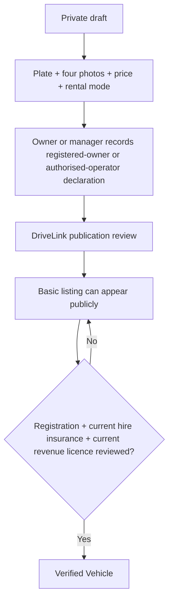

Neither level means DriveLink owns the vehicle, guarantees its mechanical condition, or promises that an insurer will accept a future claim. A self-declaration can be false, so admin review and handover plate checks remain necessary.

### Break points

| ID | Situation | Barrier or recovery |
|---|---|
| VD-01 | Modal close button moves off-screen on mobile | Fixed header and full-height modal keep close control visible |
| VD-02 | WhatsApp button bypasses booking | Vehicle detail and modal do not expose a WhatsApp booking button |
| VD-03 | Badge sounds stronger than evidence | Badge opens a precise explanation of what was reviewed and what was not |
| VD-04 | Private insurance used for paid self-drive | Prominent warning; renter must confirm with owner/insurer and may choose another listing |
| VD-05 | Listing offers both modes | Renter must explicitly choose one; the server stores the chosen mode |
| VD-06 | Airport handover offered without a driving mode | Database rejects the listing configuration |
| VD-07 | `Second driver allowed` appears from an old row | Migration resets it; public copy says verified account holder only |
| VD-08 | Renter assumes Basic means ownership documents were checked | The card and detail page say `Basic listing` and explain the missing document review |
| VD-09 | `Hire insurance` sounds like guaranteed cover | Public label says `Hire insurance declared`; Verified Vehicle explanation still says coverage is not guaranteed |
| VD-10 | Listing photos show one car but another arrives | Private plate record plus mandatory handover plate confirmation; renter reports a difference and rental cannot start normally |

---

## 8. Workflow 3: Sign up, sign in and OTP recovery

**Who:** Any visitor becoming a renter, owner, staff member or admin.

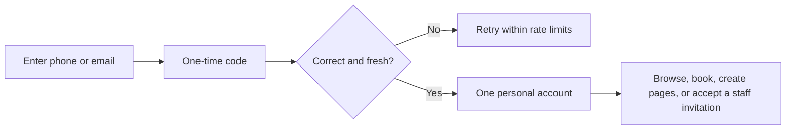

### Rules

- Signup does not ask the person to permanently choose `renter` or `provider`.
- One personal account can rent, own multiple Rental Pages, and work for pages.
- OTP codes last 10 minutes.
- Requests have a resend cooldown and server rate limits.
- A successful verification consumes the challenge atomically, so two simultaneous uses cannot both succeed.
- Placeholder email addresses used for phone-first accounts are not treated as deliverable addresses.

### Scenarios

| ID | Situation | Barrier or recovery |
|---|---|
| AU-01 | Logged-in user presses `Create Rental Page` from Pricing | Link leads to page creation, not signup again |
| AU-02 | Wrong code | Attempt fails without logging in |
| AU-03 | Expired code | Request a new code after cooldown |
| AU-04 | Repeated code guessing | Atomic attempt counter and rate limit stop the burst |
| AU-05 | Two devices submit the same valid code | Only one consumes the challenge |
| AU-06 | Phone entered in different Sri Lankan formats | Canonical phone formatting joins equivalent numbers |
| AU-07 | User is blacklisted or frozen | Login may still permit account/support access, but booking eligibility is blocked |
| AU-08 | SMS is delayed | Booking/account page remains source of truth; request another code only after cooldown |
| AU-09 | User follows a staff invitation while signed out | Sign in with the invited account, then accept; a different account cannot take it |

---

## 9. Workflow 4: Identity verification

**Who:** Every person before sending a booking request or creating a Rental Page.

### Normal path

1. User starts Didit from the account page.
2. Didit performs the configured identity and liveness workflow.
3. DriveLink accepts only a correctly signed, fresh webhook or a server-side canonical session result.
4. An approved result updates the profile and stores the required approved identity evidence privately.
5. A rejected or review result does not silently become verified.

### Scenarios

| ID | Situation | Barrier or recovery |
|---|---|
| ID-01 | User tries the retired NIC+selfie API | Route returns `410`; old browser upload prefix is blocked |
| ID-02 | Fake webhook says Approved | Signature and timestamp validation reject it |
| ID-03 | Genuine webhook is delivered twice | Stable session/event processing is idempotent |
| ID-04 | V3 uses `id_verifications[]` | Shared parser reads the official plural array |
| ID-05 | Webhook delivery fails | Signed server sync can retrieve the canonical session decision |
| ID-06 | Identity is pending | Booking and page creation stay blocked with a pending message |
| ID-07 | Identity is rejected | User sees review state and must use the approved retry/support route |
| ID-08 | Approved old profile has no local evidence image | Controlled backfill retrieves eligible approved evidence |
| ID-09 | Rental Page asks for the liveness selfie | Not shareable; only the permitted identity/licence documents can enter booking consent |

**Important:** Identity verification says the submitted identity passed the configured check. It does not prove the person will follow a rental agreement.

---

## 10. Workflow 5: Driving-licence review and self-drive eligibility

**Who:** The verified account holder who will personally drive.

### Normal path

1. User uploads front and back licence images through the private licence route.
2. User enters date of birth, first issue date, expiry date, and Sri Lankan/foreign jurisdiction.
3. DriveLink admin reviews the licence.
4. At booking time the server calculates age and licence experience on the pickup date.
5. The listing's minimum age and experience are enforced.
6. A foreign driver declares the original permit they plan to show.
7. At pickup the Rental Page must inspect the original licence and permit and tick the handover record.

### Scenarios

| ID | Situation | Barrier or recovery |
|---|---|
| DL-01 | Licence images uploaded but not reviewed | Self-drive request is blocked; with-driver remains possible where offered |
| DL-02 | Licence expires before pickup | Request is blocked |
| DL-03 | Renter turns the minimum age only after pickup | Age is calculated at pickup date, not today's date |
| DL-04 | Licence experience is below listing rule | Request is blocked |
| DL-05 | Foreign driver chooses `none` | Self-drive request is blocked and with-driver is suggested |
| DL-06 | Foreign driver declares a permit they do not actually hold | Original inspection at pickup blocks rental start; declaration is not certification |
| DL-07 | Owner skips original-document check | Pickup inspection cannot satisfy the self-drive start gate |
| DL-08 | Another family member intends to drive | Not supported; that person must not use this self-drive booking |
| DL-09 | A second driver is mentioned in chat | Agreement and database still authorize only the verified account holder |

Official starting point for current foreign-licence information: [Sri Lanka Department of Motor Traffic](https://dmt.gov.lk/index.php?Itemid=169&id=53&lang=en&option=com_content&view=article). The traveller and Rental Page must confirm current requirements with the relevant authority; DriveLink's declaration is information, not legal permission.

---

## 11. Workflow 6: Send a booking request

**Who:** Verified renter; reviewed licence additionally required for self-drive.

### Normal path

1. Choose pickup and return dates and times.
2. Choose self-drive or with-driver if both are offered.
3. Read the base estimate, deposit, delivery note and driver extras.
4. Submit at least 24 hours before pickup.
5. Server re-reads the vehicle, plate/authority publication readiness, page phone/trust state, price, dates, renter standing and licence facts.
6. Booking enters `Waiting for Confirmation`.
7. Rental Page receives an in-app notice; external alerts are best-effort.

### Request limits

| Limit | Why it exists |
|---|---|
| Maximum 4 open requests per renter | Prevent scattershot requests and provider spam |
| Maximum 8 created requests in a rolling 24 hours | Prevent create/cancel loops |
| One open request for the same vehicle | Prevent duplicates |
| Minimum 24-hour lead | Give provider and trust checks time |
| Listing min/max duration | Prevent an owner having to reject clearly invalid lengths |
| Old unanswered overlapping request can expire after 48 hours when a new overlapping request checks that slot | Prevent a silent provider blocking that slot indefinitely; this is not a global timer |

### Scenarios

| ID | Situation | Barrier or outcome |
|---|---|
| BQ-01 | Client changes price in the request | Server ignores it and snapshots current canonical rates |
| BQ-02 | Client supplies another page ID | Server derives page from vehicle |
| BQ-03 | Vehicle became unavailable after page opened | Server rejects stale submission |
| BQ-04 | Page became paused or blocked | Server rejects request |
| BQ-05 | Dates conflict with confirmed/active/disputed booking | Server and database reject |
| BQ-06 | Dates conflict only with another pending request | Both may wait; first accepted wins |
| BQ-07 | Two pages accept overlapping requests at once | Database commitment rule lets one win and closes overlapping pending requests |
| BQ-08 | User is blacklisted | Request blocked; contact support |
| BQ-09 | User account is frozen after reviewed no-return case | New requests blocked until the case is resolved |
| BQ-10 | Return time makes an extra 24-hour block | Price preview and server use the same billable-day rule |
| BQ-11 | Monthly/weekly rate is badly set above daily price | Pricing chooses the cheapest exact combination; discount cannot overcharge |
| BQ-12 | Network fails after submit | User checks Bookings before retrying; duplicate vehicle guard prevents a second open request |
| BQ-13 | My Bookings refreshes after the page contact table is locked down | An authenticated server endpoint derives the renter from the session and returns only safe booking-card fields | Page names remain visible; another renter's bookings and page contact fields are never returned |
| BQ-14 | Someone calls the booking endpoint for a page whose phone was never OTP-verified | Booking server repeats the page-phone check | Request is refused even if an old UI link still exists |
| BQ-15 | Someone calls the endpoint for a legacy `available` row without plate/authority evidence | Booking server repeats vehicle publication readiness | Request is refused; an admin cannot confirm it later either |
| BQ-16 | Page phone or owner trust changes while a request is waiting | Confirmation database rule checks the current state again | Stale staff screen cannot accept it |

---

## 12. Workflow 7: Rental Page accepts, declines, cancels or records no-show

**Who:** Owner, manager or permitted booking staff depending on action.

### Decision flow

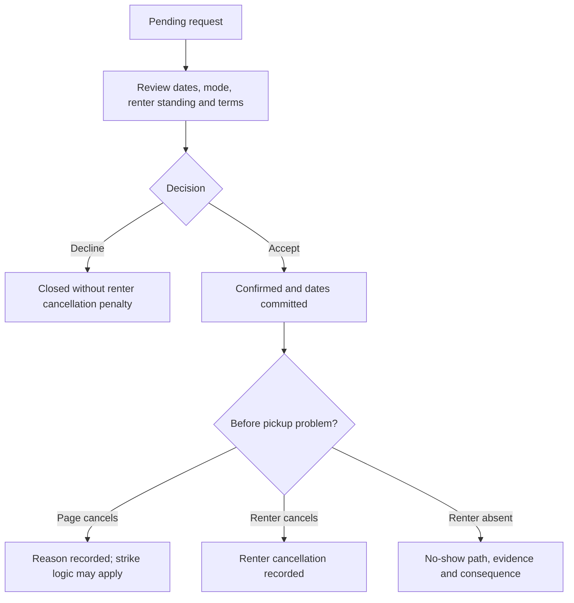

### Scenarios

| ID | Situation | Barrier or outcome |
|---|---|
| PD-01 | Page accepts an overlapping slot that another page action just committed | Database rejects the loser |
| PD-02 | Page double-clicks accept | State check makes retry idempotent or refuses stale transition |
| PD-03 | Page cancels close to pickup | Mobile confirmation explains consequence; atomic strike record avoids race |
| PD-04 | Staff records no-show too early | Time/state rules reject an impossible no-show |
| PD-05 | Renter cancels from a small mobile screen | Bottom sheet explains the action before confirmation |
| PD-06 | Page does not act for 48 hours and another renter requests an overlapping slot | The old request expires as declined, not renter-cancelled; without that later request it remains visible for manual action |
| PD-07 | External notification fails | In-app booking status and notification outbox remain the source of truth |
| PD-08 | Confirmed booking has no agreement snapshot | Confirmation must create the immutable agreement before returning success |
| PD-09 | Page records a renter no-show | The booking records who acted and when, but there is no automatic renter strike; the page must submit evidence through the separate report process if review is needed |

---

## 13. Workflow 8: Contact unlock and booking chat

**Who:** Renter, page owner, booking agent, handover agent, support agent, manager.

### Rules

- A booking thread belongs to one booking and its Rental Page.
- Before confirmation, users can discuss vehicle, dates, luggage and terms but cannot exchange direct contact details or outside links.
- After confirmation, contact details may be shared for fulfilment.
- Declined and cancelled threads are closed.
- Completed-booking chat remains writable for 30 days for receipts, fines, tolls and records, then becomes read-only.
- Damage claims still have a separate 72-hour deadline.
- The newest 500 messages are shown when a thread is very large.

### Contact boundary in one picture

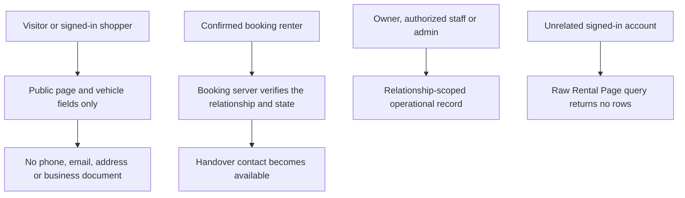

### Scenarios

| ID | Situation | Barrier or outcome |
|---|---|
| CH-01 | Renter asks `Can two suitcases fit?` before confirmation | Allowed |
| CH-02 | Renter sends phone/email/link before confirmation | Server and database reject |
| CH-03 | Creative contact spelling evades automatic detector | Admin moderation and report route remain necessary |
| CH-04 | Contact is shared after confirmation | Allowed and remains inside booking history |
| CH-05 | Staff without communication role tries to send | Role check and database policy reject |
| CH-06 | Message arrives after cancellation | Thread is read-only |
| CH-07 | Toll notice arrives 10 days after return | Message allowed within 30-day records window |
| CH-08 | Message sent on day 31 | Composer is read-only and database rejects direct insert |
| CH-09 | More than 500 messages exist | Newest 500 remain visible; full export should be used for formal evidence if needed |
| CH-10 | User needs a photo attachment | Booking chat attachment workflow is not currently supported; use the relevant inspection, claim or receipt upload surface |

---

## 14. Workflow 9: Consent-based document sharing

**Who:** Renter grants; eligible Rental Page people view.

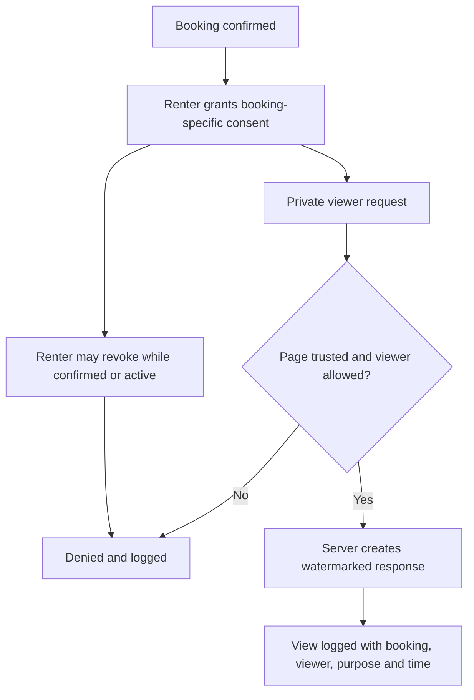

### Who may view

| Person | Requirement |
|---|---|
| Page owner | Eligible booking consent, verified/unblocked page, and a currently eligible identity-verified owner |
| Manager/booking/handover staff | Eligible consent, suitable role, plus explicit document permission |
| Fleet editor/support agent | Cannot receive renter-document permission |
| Another Rental Page owned by same person | Cannot use the first page's booking consent |
| DriveLink admin | Uses authorized trust/admin workflow, not the page viewer |

### Scenarios

| ID | Situation | Barrier or outcome |
|---|---|
| DC-01 | Renter grants before confirmation | Refused |
| DC-02 | Renter has no shareable approved document | Grant cannot create imaginary access; user must complete the document step |
| DC-03 | Page tries another renter's file key | Booking ownership and document mapping reject |
| DC-04 | Page uses consent from another booking | Booking-specific access rejects |
| DC-05 | Staff copies the raw URL | Every object request reauthorizes and returns a burned-in watermark, not an open origin file |
| DC-06 | Page is admin-suspended, deleted, unverified, or its owner loses eligibility after consent | Access ends immediately |
| DC-11 | Owner voluntarily pauses public listings while finishing an existing rental | Existing booking records remain operable; the pause blocks new public/bookable activity rather than abandoning the current rental |
| DC-07 | Renter revokes during active rental | Future views denied; past audit remains |
| DC-08 | Browser/service worker tries to cache document | Sensitive API paths are excluded and response is no-store |
| DC-09 | Unsupported active file type is uploaded | MIME, extension and file-signature checks reject or safely handle it |
| DC-10 | Renter asks who viewed documents | Sharing history reads the access audit |

**Privacy reference:** The [Sri Lanka Data Protection Authority](https://www.dpa.gov.lk/guidelines.php) publishes the Act and current guidance. DriveLink still needs formal Sri Lankan legal review of its final controller/processor duties and retention schedule.

---

## 15. Workflow 10: Digital agreement

**Who:** Verified renter and Rental Page owner/authorized side.

### Normal path

1. Confirmation freezes booking dates, rate, deposit, vehicle, page, renter and terms into an immutable snapshot.
2. The agreement clearly says whether this booking is self-drive or with-driver.
3. Both sides review the same snapshot.
4. Each side accepts with timestamp and device metadata.
5. The terms hash changes if the stored terms are altered.
6. PDF contains the accepted agreement and both acceptance times.
7. Rental cannot start until both have accepted.

### Self-drive agreement

- Verified account holder is the only renter-driver.
- Age and licence experience appear.
- Mileage, fuel, late-return and restricted-use terms appear.
- Insurance is a declaration, not a DriveLink guarantee.

### With-driver agreement

- Renter is a passenger, not the supplied driver.
- Self-drive licence, wrong-fuel, mileage and late-return duties do not apply.
- Base daily amount is distinguished from per-km, toll and overnight-driver amounts.
- Unlisted route, waiting, parking, meals, night-work and accommodation extras are not automatic.
- Rental Page remains responsible for the supplied driver's eligibility and operation.

### Scenarios

| ID | Situation | Barrier or outcome |
|---|---|
| AG-01 | Vehicle offered both modes but renter chose with-driver | Template uses booking mode, not vehicle capability |
| AG-02 | Owner changes listing price after confirmation | Existing agreement uses frozen booking snapshot |
| AG-03 | Owner changes deposit after request | Booking keeps requested deposit snapshot |
| AG-04 | One side signs and other does not | Rental start remains blocked |
| AG-05 | Old signed template exists | Rendered as its stored version; no silent rewrite |
| AG-06 | Agreement creation fails during accept | Confirmation does not pretend success without snapshot |
| AG-07 | User edits HTML in browser | Server/database state and stored hash remain authoritative |
| AG-08 | Insurance wording is misunderstood | Agreement explicitly says owner declaration and insurer/policy control |
| AG-09 | Lawyer later changes standard text | New template version applies prospectively; old contracts remain preserved |

---

## 16. Workflow 11: Direct rental payment and deposit records

**Who:** Renter and Rental Page.

### What DriveLink does and does not do

| DriveLink does | DriveLink does not do |
|---|---|
| Freeze the listed deposit into the booking | Hold the deposit |
| Record payment method and one side's statement | Prove cash physically changed hands by itself |
| Ask the other side to confirm | Automatically debit or refund money |
| Keep receipts and disagreement evidence | Guarantee a refund |
| Block completion until required confirmations | Decide a disputed amount without a case review |

### Scenarios

| ID | Situation | Barrier or outcome |
|---|---|
| PM-01 | Listing says no deposit | No deposit confirmation gate is invented |
| PM-02 | Owner asks for a higher deposit after request | Booking snapshot and agreement show the original amount |
| PM-03 | Renter records cash paid but owner says no | Two-sided state stays unresolved; do not mark paid as agreed |
| PM-04 | Owner records deposit received | Renter must confirm at pickup when a deposit applies |
| PM-05 | Partial deposit return | Written reason and amount are recorded; renter can dispute |
| PM-06 | Owner asks for passport, original NIC/licence or blank cheque as security | Agreement prohibits it; renter should refuse and report |
| PM-07 | A screen asks for DriveLink bank transfer | This is stale/invalid for the launch model and should be reported immediately |

---

## 17. Workflow 12: Pickup and rental start

**Who:** Renter plus owner/manager/handover agent.

### Mandatory order

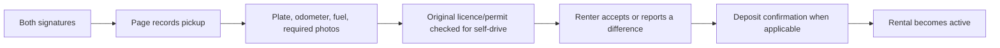

### Scenarios

| ID | Situation | Barrier or outcome |
|---|---|
| PU-01 | Page presses Start before both signatures | Database refuses |
| PU-02 | Missing required pickup photo set | Inspection save refuses |
| PU-03 | Plate differs from booked vehicle | Renter reports difference; start should not proceed until corrected/escalated |
| PU-04 | Odometer or fuel is wrong | Renter reports difference and evidence remains unresolved |
| PU-05 | Self-drive original licence not inspected | Start gate refuses |
| PU-06 | Foreign permit missing at handover | Do not hand over for self-drive; use support/change arrangement lawfully |
| PU-07 | Deposit applies but one side has not confirmed | Start remains blocked |
| PU-08 | Renter accepts pickup then owner edits evidence | Append-only/controlled inspection functions prevent unrestricted rewriting |
| PU-09 | Staff tries to start after scheduled return | Stale-start database guard refuses; use no-show path |
| PU-10 | Phone loses signal during photo upload | Keep vehicle with page until the record succeeds; retry rather than bypassing the checklist |

---

## 18. Workflow 13: Active rental, extension and normal communication

**Who:** Renter and eligible Rental Page team.

### Normal behavior

- Booking page remains the record of dates and responsibilities.
- Messages are available.
- An extension is a proposal, not a unilateral date edit.
- New end time must be at least 15 minutes ahead and no more than 30 days per proposal.
- Availability must remain clear.
- Both sides must accept before the booking dates change.

### Scenarios

| ID | Situation | Barrier or outcome |
|---|---|
| AR-01 | Renter writes `I will keep it two more days` | Message alone does not change the booking |
| AR-02 | Page proposes extension into another booking | Availability/conflict check rejects |
| AR-03 | One side accepts extension, other does not | Original return time remains |
| AR-04 | Proposal is already in the past | Refused |
| AR-05 | Proposal exceeds 30 days | Refused; use a later separate proposal after agreement |
| AR-06 | Breakdown occurs | Use booking message, incident/support steps and owner instructions; service level depends on listing/page, not a platform guarantee |
| AR-07 | Accident occurs | Prioritize safety, emergency service/police where needed, owner and insurer; keep evidence inside booking |
| AR-08 | Renter wants an unauthorized driver to take over | Not allowed under current self-drive booking |

---

## 19. Workflow 14: Breakdown, accident or urgent incident

**Who:** Renter/passenger, Rental Page, DriveLink support/admin.

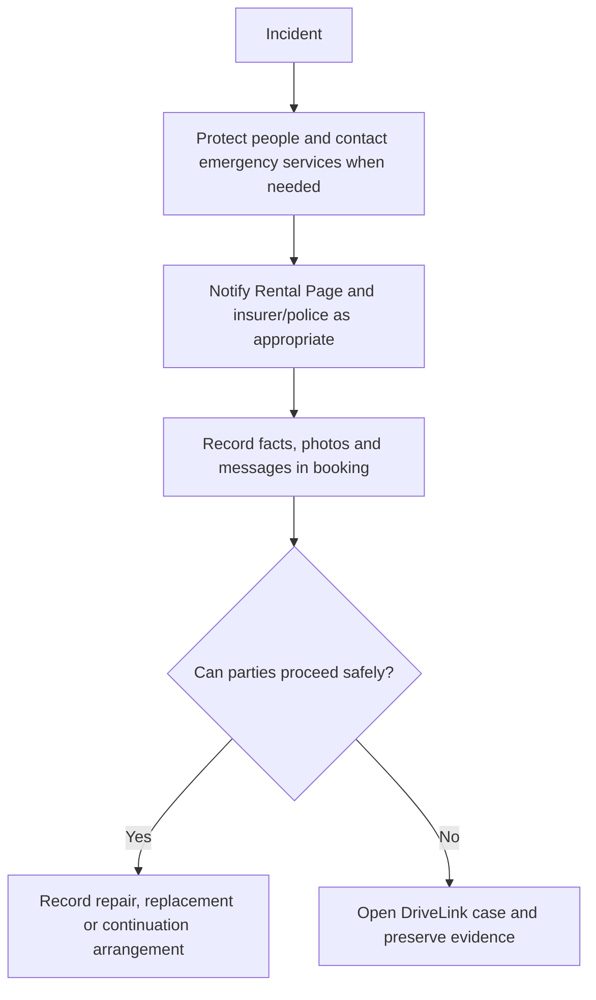

### Service truth

- A badge may say roadside, recovery or replacement is available for that listing/page.
- It does not mean DriveLink can guarantee response time or national coverage.
- DriveLink does not automatically blame the renter or owner.
- An insurer, police, court or agreed settlement may ultimately decide matters outside DriveLink.

### Scenarios

| ID | Situation | Correct action and barrier |
|---|---|
| IN-01 | Medical or road danger | Call emergency help first; app record comes after immediate safety |
| IN-02 | Minor breakdown | Contact page, record time/location/problem, follow agreed support |
| IN-03 | Page cannot provide replacement | Do not claim a guarantee; record agreed cancellation/refund arrangement |
| IN-04 | Renter makes cash roadside settlement | Agreement warns against informal settlement; notify owner/insurer/police as appropriate |
| IN-05 | One side deletes a photo from their phone | Uploaded evidence remains in controlled booking storage |
| IN-06 | Stories conflict | Case keeps each side's evidence and admin records a reasoned decision |

---

## 20. Workflow 15: Late return and no-return ladder

**Who:** Renter, Rental Page, DriveLink admin.

### Ladder

| Time/situation | What happens |
|---|---|
| Up to 2 hours late | Grace period |
| After grace | Only the listed hourly fee may be proposed; blank means no automatic fee |
| Fee grows | Capped at one daily rental rate; no stacked invented extra day |
| 24 hours overdue and unreachable | Page records reasonable contact attempts and asks DriveLink to review |
| Admin confirms critical case | Renter account can be frozen and evidence export becomes available |
| Vehicle returned/resolved | Freeze is lifted through the resolved booking path |

### Scenarios

| ID | Situation | Barrier or outcome |
|---|---|
| LR-01 | Hourly fee field was blank | No automatic fee |
| LR-02 | Page tries daily rate divided by eight | Calculation no longer invents that amount |
| LR-03 | Page adds hourly fee plus another daily fee | Cap/ledger rules prevent the automatic stack |
| LR-04 | Renter is late but communicating | Record extension or late arrangement; do not label criminal behavior automatically |
| LR-05 | Page claims unreachable after one message | Critical escalation requires recorded reasonable attempts, including spaced call/written contact |
| LR-06 | More than 24 hours overdue | Admin review, not automatic accusation, controls freeze/escalation |
| LR-07 | Renter tries a new booking while frozen | Booking server refuses |
| LR-08 | Page needs police/insurer evidence | Evidence export assembles the available agreement, identity, inspections, messages and timeline |

---

## 21. Workflow 16: Return inspection

**Who:** Renter and owner/manager/handover agent.

### Normal order

1. Vehicle is physically returned.
2. Page records return odometer, fuel and required photos.
3. Pickup and return evidence can be compared.
4. Renter accepts or reports a difference.
5. Extra-km, fuel, cleaning, late, fine/toll or damage items use the relevant evidence path.
6. Deposit return and remaining direct payment are confirmed by both sides.
7. Booking completes only when the checklist is closed or an admin resolves a dispute.

### Scenarios

| ID | Situation | Barrier or outcome |
|---|---|
| RT-01 | Page tries complete before return evidence | Database refuses |
| RT-02 | Renter has physically returned car but inspection is delayed | Renter marks physical return; final completion still waits for evidence |
| RT-03 | Page records lower fuel without photo | Renter can reject; evidence requirement applies to charge |
| RT-04 | Renter disputes one item but accepts others | Item-by-item charge response preserves the narrow disagreement |
| RT-05 | Page changes return photos after response | Controlled inspection mutation prevents unrestricted rewrite |
| RT-06 | Deposit was not returned | Completion remains blocked or case is opened |
| RT-07 | Remaining direct payment statement conflicts | Two-sided payment status remains unresolved |
| RT-08 | One side disappears after return | Recovery and admin case path handles timeout; no silent auto-win is presented as fact |

---

## 22. Workflow 17: Charges, settlement and evidence

**Who:** Renter, Rental Page, DriveLink admin.

### Charge types

| Type | Typical evidence |
|---|---|
| Extra kilometres | Pickup/return odometers and agreed rate |
| Fuel | Pickup/return fuel evidence and receipt where relevant |
| Cleaning | Return photos showing excess cleaning need |
| Late return | Booking timestamps and listed hourly rate |
| Damage | Return comparison, description and estimate |
| Fine or toll | Official notice/receipt tied to rental window |
| Other | Clear written reason and evidence; never automatic merely because it was entered |

### Deadlines

| Matter | Window |
|---|---|
| Damage or general post-return claim | 72 hours after completion |
| Official fine or toll that arrives later | Up to 30 days |
| Booking chat for records | 30 days after completion |

### Scenarios

| ID | Situation | Barrier or outcome |
|---|---|
| ST-01 | Charge added before return evidence | Refused |
| ST-02 | Renter accepts charge | Item becomes agreed; record remains |
| ST-03 | Renter disputes charge | Opens/feeds a case; no automatic collection |
| ST-04 | All items accepted but payment not confirmed | Completion waits for two-sided direct-payment record |
| ST-05 | Settlement accepted, then page changes charge | Ledger locks after acceptance |
| ST-06 | Same unresolved dispute submitted twice | Duplicate unresolved case is refused |
| ST-07 | Toll notice arrives after 72 hours but before day 30 | Fine/toll path and chat remain available |
| ST-08 | Ordinary damage claim arrives after 72 hours | Platform claim route closes; lawful external remedies are not removed |
| ST-09 | Page has no evidence | Admin can refuse the claim; entered text alone is not proof |

---

## 23. Workflow 18: Dispute and admin resolution

**Who:** Either booking party and DriveLink admin.

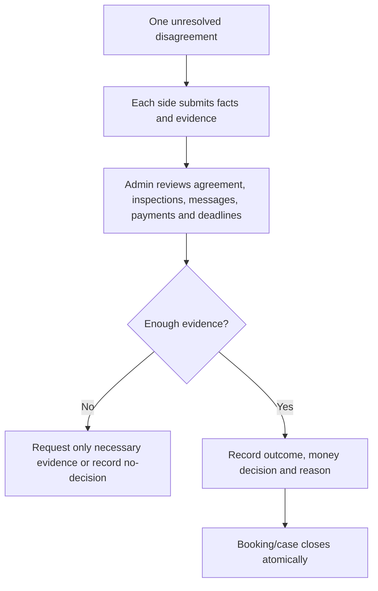

### Scenarios

| ID | Situation | Barrier or outcome |
|---|---|
| DS-01 | Renter opens a dispute | Booking and incident change together |
| DS-02 | Page opens another unresolved dispute for same booking | Refused to prevent parallel contradictory cases |
| DS-03 | Admin closes incident but forgets booking | Atomic resolution closes consistent records together |
| DS-04 | Admin tries to close without clear note | Resolution function requires explanation and evidence checklist |
| DS-05 | Evidence does not prove either claim | Admin records limited/no decision rather than inventing certainty |
| DS-06 | Party rejects DriveLink result | External legal, police, insurer or mediation rights remain |
| DS-07 | Admin account is compromised | Role checks, server-only operations and audit reduce risk; formal security monitoring remains essential |

---

## 24. Workflow 19: Completion, review, report and reliability

**Who:** Completed renter, Rental Page, DriveLink admin.

### Reputation model

- Public star reviews belong to the Rental Page, not its owner personally.
- A Rental Page cannot publish a personal star rating about a renter.
- Page teams instead see relevant booking history and internal reliability information.
- Reports need a category, factual explanation and evidence.
- High-impact blacklist/freeze action needs admin review.

### Scenarios

| ID | Situation | Barrier or outcome |
|---|---|
| RV-01 | Renter reviews completed booking | Rating updates Rental Page |
| RV-02 | Renter reviews before completion | Review policy rejects |
| RV-03 | Page tries to give renter one public star | Database policy rejects |
| RV-04 | Review contains phone/link | Public-contact trigger rejects |
| RV-05 | Personal attack or unsupported accusation | Report/moderation path; public copy should stay factual |
| RV-06 | Page reports no-return or damage | Admin checks booking evidence before account consequence |
| RV-07 | Same owner has two pages | Review affects only the booked page |
| RV-08 | Page transfer occurs later | Historical reviews remain with page, not former owner |

---

## 25. Provider lifecycle at a glance

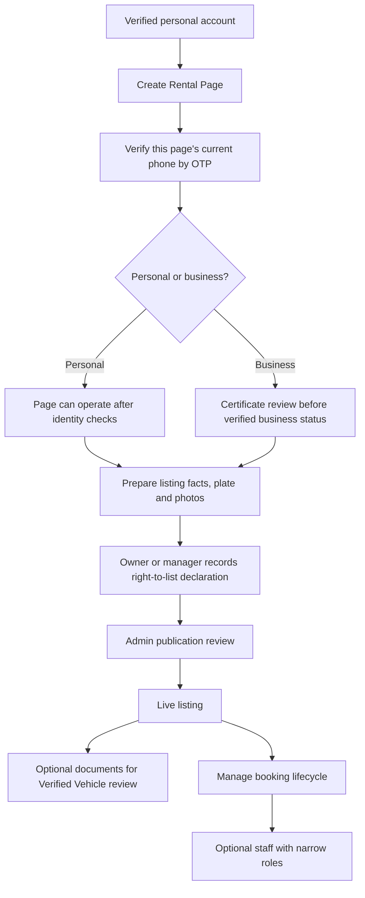

---

## 26. Workflow 20: Create and operate Rental Pages

**Who:** Verified account holder in good standing.

### Rules

- One account may own multiple Rental Pages.
- Page types are Personal and Business.
- Contact phone/email are stored for operations but are not published as free lead details before confirmation.
- Personal page means an individual host identity; it is not a registered-business badge.
- Business verification needs its certificate review.
- Creation has a short atomic rate guard against fake-page bursts, not a lifetime page cap.

### Scenarios

| ID | Situation | Barrier or outcome |
|---|---|
| PG-01 | Unverified account tries to create page | Server refuses |
| PG-02 | Blacklisted account tries | Server refuses |
| PG-03 | Logged-in user follows Pricing CTA | Goes to page creation, not signup |
| PG-04 | Same person creates second legitimate page | Allowed |
| PG-05 | Automated burst creates many pages | Atomic creation-rate guard slows/refuses burst |
| PG-06 | Page name/description includes phone/link | Screen, server and database refuse |
| PG-07 | Business lacks certificate | Can prepare page but does not receive verified-business status |
| PG-08 | Page is paused | Existing records remain; public listings and new bookings stop |
| PG-09 | Page is blocked | Sensitive renter-document access also stops |
| PG-10 | Owner's identity becomes rejected, blocked or deleted | Every owned page pauses, available vehicles are unlisted, and waiting requests cannot be confirmed |
| PG-11 | Legacy page has no page-phone OTP record | It remains out of public inventory until that page number is verified; account-phone verification is not silently reused for a different number |

---

## 27. Workflow 21: Create, review and update a listing

**Who:** Owner, manager or fleet editor; admin reviewer.

### Basic listing

1. Add vehicle identity, including the real registration plate. The plate stays private from public search.
2. Add type, rental mode, city, price, deposit, mileage and structured rules.
3. Add at least four clear photos. Newly uploaded public vehicle images receive a server-side DriveLink watermark before save.
4. The Rental Page owner or manager chooses the true authority basis: `registered owner` or `authorised operator`, then personally confirms the declaration. A fleet editor may prepare a private draft but cannot make this declaration.
5. Registration, insurance and revenue-licence files are optional for Basic listing submission.
6. Every listing waits for admin publication review. Admin sees that authority is self-declared and may ask an authorised operator for written proof.
7. Only then can the `Basic listing` label appear publicly. Basic does not mean DriveLink reviewed the vehicle documents.

### Verified Vehicle

DriveLink reviews the uploaded registration, current hire-insurance and current revenue-licence evidence for the exact listing. The label does not certify future insurance coverage, mechanical condition, fulfilment quality, or every legal duty.

### Scenarios

| ID | Situation | Barrier or outcome |
|---|---|
| VL-01 | Fewer than four photos | Screen and database reject submission |
| VL-02 | One photo upload fails | New-listing wizard stops and keeps user on retry path; edit flow reports partial failure |
| VL-03 | File is HTML/SVG disguised as an image | File-signature validation and safe processing reject |
| VL-04 | Listing contains no self-drive/with-driver mode | Screen and database reject |
| VL-05 | Listing enables unsupported second driver | UI has no toggle and database rejects true value |
| VL-06 | Owner publishes contact details | Database rejects even direct edit |
| VL-07 | Owner tries to self-approve/feature/verify | Protected moderation columns cannot be directly changed |
| VL-08 | Admin approves Basic listing | It can go live without Verified Vehicle badge |
| VL-09 | Trust-sensitive field changes after approval | Listing re-enters review and verification is cleared where appropriate |
| VL-10 | Only price changes | Current re-review rules decide whether publication remains; accepted bookings keep old snapshot |
| VL-11 | Existing pre-watermark photo remains | Backfill rewrites eligible public images |
| VL-12 | Broker screenshots watermarked image | Watermark remains a deterrent but cannot technically prevent all screenshots |
| VL-13 | Plate is missing | Screen, publication server and database keep the listing private |
| VL-14 | Same car is entered with different hyphens/spaces in its plate | Punctuation-free plate identity rejects the duplicate |
| VL-15 | Fleet editor prepares a car | It saves as a private owner-review draft; the editor cannot make the authority declaration |
| VL-16 | Fleet editor crafts a direct database update to declare ownership | Database role check refuses it and keeps the declaration empty |
| VL-17 | Page operates a family/leased/managed vehicle | It chooses `authorised operator`; admin may request written authority and compare the registration record |
| VL-18 | Admin rejected a listing | Owner cannot press/call `Relist`; they must fix the reason and resubmit for review |
| VL-19 | Plate, declaration, photos, mode or price is removed from a live row by a privileged process | Database refuses leaving that row `available` |
| VL-20 | Owner changes the authority basis | Listing returns to review and public badges/featured state are cleared |
| VL-21 | Owner lies in a declaration | Timestamp and declaring account are preserved, but software cannot prove a statement is true; admin evidence checks, reports and legal consequences remain necessary |

---

## 28. Workflow 22: Availability and competing requests

**Who:** Renter, page fleet team.

### Rules

- Maintenance blocks hide dates.
- Confirmed, active and disputed bookings commit dates.
- Pending requests can overlap.
- Back-to-back bookings are allowed when one ends exactly when another begins.
- Acceptance is the moment a pending request becomes a committed reservation.

### Scenarios

| ID | Situation | Barrier or outcome |
|---|---|
| AV-01 | Two renters request same slot | Both can wait |
| AV-02 | Page accepts renter A | A commits dates; overlapping pending requests are closed |
| AV-03 | Two accept actions race | Database exclusion gives one consistent winner |
| AV-04 | Owner adds maintenance after pending requests | Pending requests can be declined; committed booking needs proper cancellation/change handling |
| AV-05 | Anonymous visitor checks dates | Privacy-safe availability returns ranges only |
| AV-06 | Time boundary is exactly back-to-back | Allowed by strict overlap comparison |

---

## 29. Workflow 23: Staff invitation and permissions

**Who:** Page owner invites; recipient accepts.

### Normal path

1. Owner chooses email and the narrowest role.
2. Invitation lasts seven days.
3. Invitee signs in as the intended account and accepts or declines.
4. Membership and access event are recorded.
5. Owner can change role, separately grant/revoke document permission, or remove member.

### Scenarios

| ID | Situation | Barrier or outcome |
|---|---|
| TM-01 | Wrong account opens invitation | Cannot accept another person's invitation |
| TM-02 | Invitation is older than seven days | Expired |
| TM-03 | Owner invited booking agent but employee needs only handover | Owner changes to handover role; event recorded |
| TM-04 | Fleet editor tries to view bookings | Capability policy rejects |
| TM-05 | Support agent tries to edit a vehicle | Capability policy rejects |
| TM-06 | Manager membership exists | Broad operations allowed, but document viewing still needs separate permission |
| TM-07 | Role changes from booking to fleet | Incompatible document permission is automatically removed |
| TM-08 | Employee leaves | Owner removes member; later requests lose access |
| TM-09 | Staff knows an old direct URL | Server and database re-check current membership each time |
| TM-10 | Fleet editor creates a new vehicle | Complete details save privately as `Owner review needed`; no public or booking state is possible yet |
| TM-11 | Fleet editor claims the page owns the car | Hidden control in the normal UI plus database role check reject the crafted request |
| TM-12 | Manager makes the declaration | Allowed and attributed to that manager; changing it returns the listing to DriveLink review |

---

## 30. Workflow 24: Page switching, ownership transfer, pause and deletion

**Who:** Multi-page owner, staff member, transfer recipient.

### Page switcher

- Personal marketplace context and each Rental Page are separate operating contexts.
- Active page is stored in a secure cookie.
- Every dashboard query still checks actual page ownership/membership; the cookie alone grants nothing.

### Ownership transfer

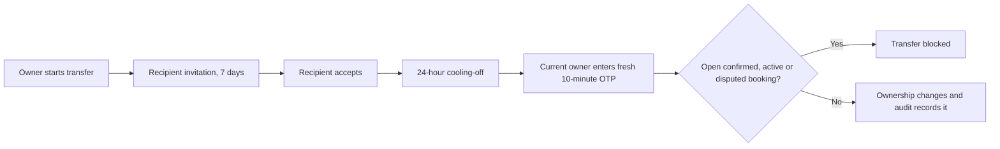

### Scenarios

| ID | Situation | Barrier or outcome |
|---|---|
| PS-01 | User edits active-page cookie to page they do not own | Layout/query authorization rejects |
| PS-02 | Owner transfers during active rental | Blocked |
| PS-03 | Recipient accepts then owner changes mind in cooling-off | Owner can cancel before final confirmation |
| PS-04 | Stolen old OTP used | OTP is fresh, short-lived and consumed atomically |
| PS-05 | Page paused | New public/bookable activity stops; records remain |
| PS-06 | Account deletion hides its pages | Pages record account deletion as source |
| PS-07 | Account recovered | Only account-deleted pages return in a paused placeholder state; earlier block remains |
| PS-08 | Admin-deleted page exists | Account recovery does not revive it |
| PS-09 | Owner changes the page phone | Old page-phone verification and OTP are cleared; page and available vehicles pause until the new number passes OTP |
| PS-10 | One page fails a deletion safety check | The whole account/page deletion rolls back; the owner is never left half deleted |
| PS-11 | Page is deleted | Contact/assets are scrubbed, vehicles unlisted, staff removed, and pending staff/transfer invitations cancelled in one database operation |
| PS-12 | Restored personal page is prepared to resume | Owner must redo identity verification, restore page details and verify the page phone first |
| PS-13 | Restored business page is prepared to resume | Business verification is cleared because its certificate file was deleted; a new review is required |

---

## 31. Workflow 25: Admin and trust operations

**Who:** DriveLink admin.

### Main work queues

| Queue | Decision |
|---|---|
| Identity/Didit reconciliation | Is the verified result authentic and complete? |
| Driving licence | Do dates, jurisdiction and images support approval? |
| Rental Page/business | Is the page eligible and is the business certificate sufficient? |
| Vehicle publication | Is listing plausible, clear and compliant enough to publish? |
| Verified Vehicle | Do required current documents support that specific label? |
| User/page/listing report | Is the report factual, evidenced and within policy? |
| Late/no-return | Were reasonable contact attempts made and is a freeze justified? |
| Dispute/case | What do agreement, evidence and responses support? |
| Notification/operations | Are workers, queues and providers healthy? |

### Scenarios

| ID | Situation | Barrier or outcome |
|---|---|
| AD-01 | Admin rejects listing | Provider receives in-app outcome/reason path |
| AD-02 | Admin changes trust state without evidence | Audit trail and reason requirements make decision reviewable |
| AD-03 | Admin resolves only one half of a dispute | Atomic case resolution keeps incident and booking consistent |
| AD-04 | Admin tries to rate renter personally | Public personal-rating path is removed |
| AD-05 | Notification provider fails | Outbox keeps attempt/failure state; in-app record remains |
| AD-06 | Worker heartbeat is stale | Operations health surfaces job failure before silent backlog grows |
| AD-07 | Sensitive document requested casually | Admin should use the specific review/case purpose, not broad browsing |
| AD-08 | Police requests data | Verify authority, scope and legal basis; disclose only necessary records and log the action |

### Human decision rule

An admin should never convert suspicion into a public accusation. Record observable facts: `vehicle not returned by agreed time`, `two contact attempts recorded`, `official toll notice attached`. Avoid labels such as thief or fraudster unless a lawful authoritative finding supports them.

---

## 32. Workflow 26: Notifications and outage recovery

**Who:** Every user and the operations team.

### Notification order

1. The database or server records the real event.
2. In-app booking/page status becomes authoritative.
3. Notification outbox attempts configured SMS, WhatsApp and/or email.
4. Failure is logged and can be retried or investigated.

### Scenarios

| ID | Situation | Barrier or recovery |
|---|---|
| NT-01 | SMS never arrives | Open DriveLink; state is already recorded |
| NT-02 | WhatsApp session is offline | Other configured channel may run; in-app still works |
| NT-03 | Email is placeholder/non-deliverable | Email send is skipped rather than pretending success |
| NT-04 | User receives duplicate alert | Event should remain idempotent; duplicate message does not duplicate booking action |
| NT-05 | Cron worker stops | Heartbeat/operations monitor shows stale worker |
| NT-06 | Database temporarily fails during action | UI must show failure; user checks current state before retrying |
| NT-07 | Upload succeeds but later save fails | Orphan sweep and retry path handle file; user should not assume workflow completed |

---

## 33. Workflow 27: Traffic analytics and privacy preference

**Who:** Visitors, signed-in users, admin analytics viewer.

### What is recorded

- A random first-party session ID.
- Landing path without query-string content.
- Source category such as Google, Facebook, Instagram, TikTok, YouTube, WhatsApp, campaign or direct.
- Basic device and browser family.
- Page, vehicle, search, guide and booking-funnel events.
- Signed-in link when available.
- `Active now` means activity within the last five minutes, not a perfect count of human eyeballs.

### What is deliberately not stored in this traffic system

- Raw IP address.
- Full user-agent string.
- Full URL query strings.
- Typed form text.
- Booking messages or document contents.

### Privacy controls

| Control | Behavior |
|---|---|
| Global Privacy Control | Analytics client stays off |
| Do Not Track | Analytics client stays off |
| DriveLink local opt-out | Analytics client stays off |
| Session cookie | HttpOnly, SameSite Lax, secure in production, maximum 180 days |
| Retention | Sessions and related events pruned after 13 months |
| Event flood | Maximum 30 events/minute and 300/hour per session, plus duplicate suppression |
| Browser table access | None; analytics tables are server/admin only |

### Scenarios

| ID | Situation | Barrier or interpretation |
|---|---|
| AN-01 | One person uses two devices | Counted as two sessions; do not call it two unique people with certainty |
| AN-02 | Bot loads pages | May appear; analytics are directional, not audited billing data |
| AN-03 | User opts out after earlier visits | Future client events stop; existing retained data follows privacy/retention policy |
| AN-04 | Account deleted | Analytics user link is removed where designed; anonymous aggregate session may remain until retention expiry |
| AN-05 | Attacker floods events | Origin validation, allow-list, duplicate suppression and per-session caps limit noise |
| AN-06 | Campaign query contains personal data | Only named UTM fields are cleaned/stored; teams must never place personal data in campaign URLs |

---

## 34. Workflow 28: Account deletion and 30-day recovery

**Who:** Signed-in account owner.

### Normal path

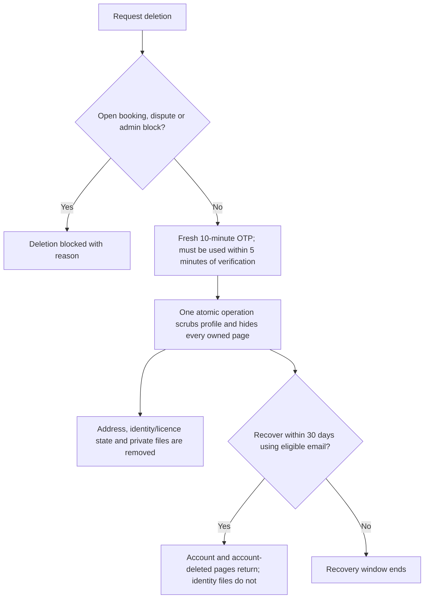

### Scenarios

| ID | Situation | Barrier or outcome |
|---|---|
| DE-01 | Active booking exists | Deletion blocked |
| DE-02 | Dispute exists | Deletion blocked |
| DE-03 | User owns page despite stale renter role | Real ownership query finds blocker |
| DE-04 | Old session tries deletion | Fresh OTP reauthentication required |
| DE-05 | Correct OTP verified too long ago | Five-minute freshness rule refuses final delete |
| DE-06 | User recovers | Profile and eligible pages return paused; identity/licence files and verification must be completed again |
| DE-07 | Page was blocked before deletion | It returns still blocked |
| DE-08 | Page was admin-deleted | It does not return |
| DE-09 | User expects every trace removed | Privacy copy explains limited anti-abuse phone/identity identifiers and legal records may remain |
| DE-10 | Phone-only account has no real recovery email | Recovery may not be possible; screen must warn before final deletion |
| DE-11 | Recovery email delivery fails | Deletion stops before the database changes, so the user is not deleted without the promised recovery path |
| DE-12 | Account owns several pages | Every live page is scrubbed in the same transaction or none are |
| DE-13 | Restored business had been verified | It returns unverified because the supporting certificate was permanently removed |

---

## 35. Workflow 29: Guide videos inside DriveLink

**Who:** Public renter/traveller; authorized owner/staff/admin.

### Guide visibility

| Guide | Who sees it inside DriveLink |
|---|---|
| First booking | Everyone |
| Self-drive in Sri Lanka | Everyone who may need traveller guidance |
| Create Rental Page/list vehicle | Page owners |
| Run rental request-to-return | Page owners |
| Work safely as staff | Current Rental Page staff |
| Admin review and resolution | DriveLink admins |

### Player behavior

- Opens in a full-height mobile dialog with close button always visible.
- Uses privacy-enhanced YouTube embed.
- Saves playback time per guide in local browser storage.
- Closing and reopening continues near the saved point.
- `Start over` clears the saved point.
- Escape, backdrop close and keyboard focus trapping are supported.

### Scenarios

| ID | Situation | Barrier or outcome |
|---|---|
| GV-01 | Renter visits Academy | Sees only public renter/traveller guides |
| GV-02 | Owner signs in | Owner guides appear |
| GV-03 | Staff signs in | Staff guide appears; owner guide appears only if they also own a page |
| GV-04 | Admin signs in | Admin guide appears |
| GV-05 | User closes at 37 seconds | Local browser remembers progress |
| GV-06 | User changes device/browser | Progress does not follow; it is local, not account-synced |
| GV-07 | Browser blocks local storage | Video works but resume may not persist |
| GV-08 | YouTube link is forwarded | Public Shorts remain externally reachable; in-app role filtering is not video DRM |
| GV-09 | Sinhala/Tamil captions are missing in player | Caption tracks must be uploaded/enabled on YouTube; local SRT files alone do not affect embed |

---

## 36. Malicious and accidental misuse catalog

| Actor/action | Main barriers | Residual risk |
|---|---|---|
| Fake renter | Identity, licence review, request caps, page decision, original document check | A verified person can still behave badly; human judgment remains |
| Fake owner/listing | Owner identity, page state, listing review, document review, reports | Admin may miss a convincing fake; pilot monitoring matters |
| Duplicate/fake vehicle identity | Private plate required, punctuation-free duplicate check, declaration account/timestamp, admin review, handover plate check | A false plate or sophisticated forged evidence still needs human detection |
| Broker harvesting leads | Contact-text blocks, pre-confirmation chat gate, image watermark | Screenshots and creative obfuscation cannot be eliminated |
| Signed-in raw-database scraper | Page and raw-vehicle rows limited to owned/staffed/admin scope; public search returns safe fields | Public listing facts and watermarked images remain intentionally visible |
| User alters client request | Server derives parties/rates/state; database rules | New endpoints must continue the same pattern |
| Staff overreaches | Narrow role, separate document permission, audit, removable membership | Manager is powerful; owners must assign it carefully |
| Stolen old document URL | Reauthorization on every request, no-store, page state and consent | Authorized viewer can still photograph a screen |
| Replay of OTP/webhook | Expiry, timestamp, atomic consumption/idempotency | Provider outage and clock problems require monitoring |
| Evidence edited after dispute | Controlled functions, immutable snapshots, hashes and audit | A party may withhold off-platform evidence |
| Notification failure | In-app source of truth and outbox | User may not check app; support process remains needed |
| Analytics spam | Origin/event allow-list and caps | Numbers remain operational estimates, not financial truth |
| Admin mistake | Reasoned queues, atomic actions and audit | Two-person approval is not yet universal for every critical action |

---

## 37. Unsupported or controlled-only scenarios

These must not be sold as finished workflows.

| Scenario | Current response |
|---|---|
| Book self-drive for a spouse/friend | Not supported; verified account holder must be driver |
| Add a second self-drive driver | Not supported |
| Company books for changing employees | Not supported as a distinct corporate-driver workflow |
| Category booking such as `Axio or similar` | Not built |
| Enterprise API, webhook, CSV or calendar feed | Not built |
| Alternative vehicle offer inside a request | Not built as a structured workflow |
| Branch-level fleet/staff/reporting | Not built |
| Assign and verify a chauffeur in DriveLink | Not built |
| Full airport flight tracking and waiting-time logic | Not built |
| Dispatch a neutral mechanic/carrier from DriveLink | Not built |
| Guarantee national roadside response/replacement car | Not offered |
| DriveLink holds rent or deposit | Not offered |
| Instant booking | Not offered; page accepts first |
| Saved payment method | Not offered |
| Sponsored listing boost | Not active |
| Sinhala/Tamil product interface | Not available yet |
| iOS native wrapper | Not current launch surface |

### Safe way to handle a requested unsupported scenario

1. Do not pretend an ordinary booking field covers it.
2. Explain the limit before sensitive documents or money move.
3. Use with-driver or a normal verified-account-holder booking only when it genuinely fits.
4. For a pilot, record the manual process, responsible person and failure plan.
5. Build a generic workflow only after repeated real cases prove the requirement.

---

## 38. Market-specific scenario notes

### Colombo and Negombo local rentals

- Strong fit for controlled self-drive, airport handover and short rentals.
- Availability, exact pickup point, traffic delay and handover time matter.
- Avoid implying airport handover is an airport transfer.

### Foreign-tourist self-drive

- Highest sensitivity around permit, original documents, insurance conditions and emergency instructions.
- DriveLink's permit choice is a declaration for the page, not legal approval.
- Prefer Verified Vehicle and clearly disclosed hire-insurance listings, while still confirming actual policy terms.

### With-driver tourism

- Basic booking is possible.
- Route, passengers, luggage, waiting, tolls, parking, meals, accommodation and night work must be written before signing.
- Do not scale until the itinerary/driver-assignment workflow exists.

### Long-term rental

- Monthly price can be displayed and snapshotted.
- Current product does not fully manage recurring monthly payment dates, maintenance rotations, tyre/battery responsibility, replacement vehicle, periodic inspections, insurance/revenue renewals or early termination.
- Use a carefully reviewed custom operating process during a small pilot.

### Private hosts

- DriveLink can be their main workflow.
- They need the clearest possible next action and strong reminders not to take banned security items or bypass inspections.
- If the registration is in a spouse, parent, finance company or another owner's name, the page must choose `authorised operator` rather than claiming registered ownership. DriveLink may request written authority; the declaration alone is not proof.

### Small rental businesses

- Multi-vehicle and staff roles fit.
- Use separate roles instead of making every employee Manager.
- Multiple legal brands should use separate Rental Pages.

### Large enterprise provider

- DriveLink should be presented as a potential distribution/integration channel, not a finished ERP replacement.
- A pilot should minimize double entry and should not expose competitor/customer data outside the agreed purpose.

---

## 39. Manual operating procedures DriveLink still needs

Software barriers cannot replace these human procedures.

### Daily

1. Check worker/notification health.
2. Review pending identity, licence, business and listing queues.
3. For each Basic listing, compare the private plate, declaring account and authority basis; request written authority when the page is not the registered owner.
4. Review rentals starting and ending today.
5. Review overdue contact ladders and open cases.
6. Investigate unusual analytics spikes as possible bots before treating them as demand.

### Before every pickup

1. Confirm correct vehicle and plate.
2. Confirm both signatures.
3. Inspect original licence/permit for self-drive.
4. Record complete pickup evidence.
5. Let renter review and report differences.
6. Confirm direct deposit record if one applies.
7. Only then start rental.

### Before every completion

1. Confirm physical return.
2. Record return evidence.
3. Resolve each charge response.
4. Resolve deposit and remaining direct payment confirmations.
5. Open case if facts conflict.
6. Complete only when checklist passes.

### Weekly

1. Sample document access logs for unusual repeated viewing.
2. Review admin actions and page cancellation strikes.
3. Review reports for repeated page/vehicle/user patterns.
4. Verify evidence export queue and backups.
5. Confirm public copy still matches current money and service model.
6. Confirm the migration ledger matches the latest repository migration and no temporary verification listings remain public.

---

## 40. Release and marketing readiness gate

Do not call the system ready merely because the home page loads. A supervised pilot is ready only when all items below pass on production.

### Technical gate

- [x] Application lint, type check and 98-route production build pass.
- [x] Database migrations through 121 are deployed; a private DriveLink migration baseline through 121 is recorded and future migrations are checksum-tracked.
- [x] Automated booking lifecycle, claims, return recovery, self-drive, document security, staff permissions, page transfer, account deletion, analytics and payment-copy suites pass.
- [x] New vehicle images use server-side watermarking; the backfill scan found no unprotected retrievable legacy image.
- [x] Approved Didit profiles eligible for local evidence were backfilled; rerunning the job is idempotent.
- [x] Production security headers, private health and operations monitor pass.
- [x] Final production booking UI pass: 47 of 47, including mobile layout and protected background refresh.
- [x] Final production listing/contact pass: 20 of 20 listing-trust and 8 of 8 contact-boundary checks.
- [x] Final production role/eligibility pass: 10 of 10 fleet-staff and 10 of 10 self-drive checks.
- [x] Final production private-document pass: 31 of 31; critical return/recovery and evidence export: 26 of 26.
- [x] Final production account-deletion pass: 11 of 11 on desktop/mobile.

The live application version verified for this document is Cloudflare Worker `3ba72af9-d470-4a9d-a6dc-7f75ac8e46e4`. Cron version is `2ac056bb-d9e3-40a0-b786-f7130fbe4420`; operations-monitor version is `fa60ab13-cfdd-48bd-8d5e-05d9a4dca924`.

### Current production inventory blocker found in this audit

As of 13 August 2026, the public query correctly returns **zero vehicles**. The database contains 17 legacy/demo vehicle rows across seven Rental Pages. All 17 predate the recorded right-to-list declaration, one also has no plate, and all seven pages with vehicles lack a page-specific phone OTP record. The migration moved every incomplete `available` row out of public inventory instead of inventing ownership or phone verification.

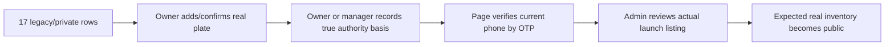

Before marketing inventory:

1. Remove test/demo pages, or keep them private.
2. Each real page owner must open every intended listing, confirm the real private plate, and record whether the page is the registered owner or an authorised operator.
3. Each real page owner must verify that page's current number in Page Settings.
4. Admin must inspect the authority basis and public facts, request written authority where appropriate, and approve the corrected listing.
5. The public-inventory probe must return exactly the intended real vehicles with no private fields.
6. A signed-in unrelated account must still receive no Rental Page contacts or raw vehicle rows.

### Two-account real-device gate

1. Renter browses signed out on a phone.
2. Owner creates Personal Rental Page and a Basic listing.
3. Admin approves it.
4. Renter verifies identity and licence, requests self-drive, and page accepts.
5. Pre-confirmation contact leak is rejected; post-confirmation contact works.
6. Renter grants and revokes document consent; every view is watermarked/logged.
7. Both sign agreement.
8. Pickup cannot start until complete evidence and renter acceptance.
9. Return cannot complete until evidence, charges, deposit and payment states close.
10. Review changes Rental Page rating only.
11. Admin-suspended or owner-ineligible page loses public/bookable/document access; an ordinary voluntary pause still preserves existing booking operations.
12. Second page owned by same account cannot read first page's booking/documents.

### Human/legal gate

- Sri Lankan lawyer reviews Terms, Privacy, agreement, consent, dispute, late/no-return and evidence-export wording.
- Insurance professional reviews hire/private labels and responsibility wording.
- DPA obligations, vendors, retention, incident response and cross-border processing are documented.
- Support has a named owner and response procedure for every manual queue.
- Marketing promises only service levels DriveLink and each listing can actually provide.

---

## 41. Quick scenario index by person

| Person | Read these workflows first |
|---|---|
| First-time renter | 1, 2, 3, 4, 6, 9, 10, 11, 12, 16 |
| Self-drive renter | 2, 4, 5, 6, 9, 10, 12, 13, 14, 15, 16, 17 |
| Foreign visitor | 2, 4, 5, 6, 10, 12, 14 |
| With-driver passenger | 2, 6, 10, 11, 13, 14, 16 |
| Private host | 20, 21, 22, 7, 8, 9, 10, 11, 12-19 |
| Small rental business | 20-25 plus all booking workflows |
| Fleet editor | 21 and 22 |
| Booking agent | 7, 8 and 22 |
| Handover agent | 8, 12, 16 and 17 |
| Support agent | 8, 14, 15, 18 and 26 |
| Manager | All provider and booking workflows |
| DriveLink admin | 4, 5, 18, 19, 21, 25, 26, 27 and 34 |
| Enterprise prospect | Audience map, unsupported scenarios and market notes |

---

## 42. Final plain-English conclusion

DriveLink's supported launch product is a controlled marketplace for one verified account-holder renter, verified Rental Pages, exact vehicle listings, page acceptance, direct payment records, consent-based documents, two-sided agreements, mandatory inspections, evidence-backed return settlement, page reputation and manual dispute review.

Its strongest safety idea is not a badge. It is the chain of records that makes both sides slow down at the important moments: identity, eligibility, acceptance, consent, agreement, pickup, return, money confirmation and dispute evidence.

The product must stay honest about the boundary. It is not yet an enterprise integration network, a full chauffeur-dispatch system, a roadside guarantee, a payment custodian, a multilingual product, or a way to book self-drive for somebody else. Those are future products with their own risks, not checkboxes to hide inside today's flow.
